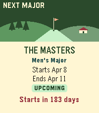
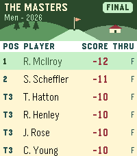
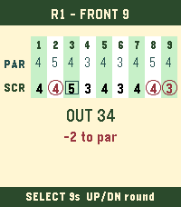
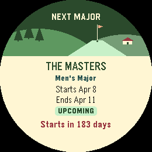
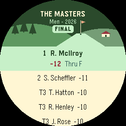
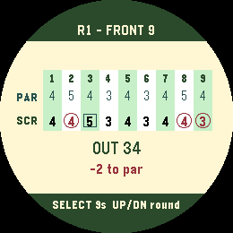

# Pebble Golf Live ⛳

Follow live professional golf tournaments, leaderboards and player scorecards from your Pebble.

**Website:** https://pebblegolflive.n3evin.com/

## Install

- [Get on Pebble Core Store](https://apps.repebble.com/80828e5b66b947ed982d4941)
- [Get on Rebble Store](https://apps.rebble.io/en_US/application/6ac5d5ac836dec0009992f81)

## Supported Watches

- Pebble Time 2
- Pebble Round 2

## Features

- PGA Tour coverage
- LPGA Tour coverage
- Men's and women's majors
- Live leaderboards
- Player scorecards
- Upcoming tournaments
- Historical results
- Pebble Timeline integration
- Touch and button navigation
- 60-second live score refresh while the app is active

## Screenshots

| | Next major | Leaderboard | Scorecard |
|---|---|---|---|
| **Pebble Time 2** |  |  |  |
| **Pebble Round 2** |  |  |  |

## Bugs and Feature Requests

Please use the [Issues](../../issues) tab for:

- bug reports
- feature requests
- UI feedback
- data issues

## Golf Data

Pebble Golf Live currently uses unofficial ESPN public golf feeds for tournament data.

## Source Code

The Pebble application source code is maintained separately and is not included in this public repository.
